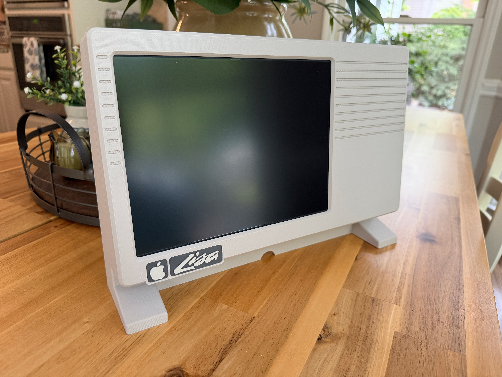

# Lisa Mini

A 3D-printable, Apple Lisa–inspired enclosure for building a mini all-in-one
around a [LisaFPGA](https://www.tindie.com/products/lisafpga/) board and an
11.6" 1080p widescreen LCD panel.


<!-- TODO: replace with a real photo once uploaded to images/ -->

## About

This case is designed to house a LisaFPGA board — an FPGA-based
re-implementation of the original Apple Lisa — behind a compact modern LCD,
in an enclosure that echoes the look of the original 1983 Lisa: front vent
lines, a screen that leans back while the case stays vertical, and integrated
L-shaped feet with no visible seams between leg and case.

Designed for FDM printing, optimized to minimize supports where possible —
though both the front and back shells currently do need some supports
(see [Printing](#printing) below).

There's no built-in FloppyEmu, because the LisaFPGA has a floppy emulator
built in (ESFloppy) — no separate hardware needed. The case already has
cutouts for the ESFloppy control buttons and a window to see the screen
from the back, dressed up with a shroud
(`Lisa_Mini_ESFloppy_Shroud.obj`) since that opening currently sits well
below the back surface. The shroud's fit isn't perfect yet — it exposes a
bit too much of the area below the ESFloppy LCD, and needs some glue to
stay in place — so it may get replaced with an improved version later. Once
ESFloppy support is finished, front-mounting
that screen and those buttons (via cable) is a possibility for a future
revision — though the widescreen LCD covers much of that area, so it may
not be feasible.

## What's here

```
models/
  print-ready/   Final OBJ files, ready to slice and print
  source/        Parametric OpenSCAD source + design notes
images/           Build photos and renders
docs/
  ASSEMBLY.md     Step-by-step build instructions
  BOM.md          Parts and hardware you'll need
  PRINTING.md     Slicer settings and printing notes
```

## Parts to print

| File | Part |
|---|---|
| `Lisa_Mini_Front_11.6_LCD_Mount_With_Logo_Plate_Holders.obj` | Front bezel / LCD mount |
| `Lisa_Mini_Back_LisaFPGA.obj` | Rear shell, sized for the LisaFPGA board |
| `Lisa_Mini_LCD_Mount_Clips.obj` | LCD retaining clips |
| `Lisa_Mini_Lisa_Logo_Plate.obj` | Lisa logo badge insert (see note below) |
| `Lisa_Mini_Manufacturer_Blank_Logo_Plate.obj` | Blank badge insert for the bezel's second holder (see note below) |
| `Lisa_Mini_Power_Switch.obj` | Cap that sits over the LisaFPGA board's own switch — no separate switch hardware |
| `Lisa_Mini_ESFloppy_Shroud.obj` | Dresses up the rear ESFloppy screen opening, which currently sits well below the back surface |

See [`docs/BOM.md`](docs/BOM.md) for the LCD panel, LisaFPGA board, and
hardware you'll need, and [`docs/ASSEMBLY.md`](docs/ASSEMBLY.md) for the
build sequence.

**Logo plate note:** the front bezel has holders for two badge plates. This
repo includes the Lisa logo plate (`Lisa_Mini_Lisa_Logo_Plate.obj`) for one
and a plain, unbranded insert
(`Lisa_Mini_Manufacturer_Blank_Logo_Plate.obj`) for the other — deliberately
not shipping an Apple logo plate here to avoid distributing Apple's
trademarked logo. If you want an Apple logo in that spot, you'll need to
source or model your own.

## Editing the design

The parametric source (`models/source/lisa_modern_template.scad`) is an
OpenSCAD model of the case shell and covers the overall body/vent/leg
geometry. `models/source/lisa_design.md` documents the design reference
image this was built against and the reasoning behind the current shape —
read it before changing proportions.

Note: the `print-ready/` OBJs are further along than the `.scad` source
file. The OpenSCAD model produced a simplified starter shell, which was
then brought into TinkerCAD for significant additional work — mounting
points, port/switch openings, LCD clip geometry, and the logo plate —
that isn't reflected in the `.scad` file. Treat the `.scad` file as the
best starting point for overall shell/vent/leg proportions, not as a 1:1
source for the exact release files; there's currently no single parametric
source that captures the final printed geometry end to end.

## Software

The case's screen opening is sized for the original 9.7" 4:3 Lisa-style
window, but the LCD actually used is an 11.6" 1080p widescreen panel — the
image doesn't natively fill (or center in) that opening. This build
requires [wottle/LisaFPGA](https://github.com/wottle/LisaFPGA), a fork of
the LisaFPGA software that adds the ability to offset the displayed image
so it lands correctly within the case's opening. Stock LisaFPGA firmware
will not position the image correctly for this case.

**Flash it before assembling the case** — see
[`docs/ASSEMBLY.md`](docs/ASSEMBLY.md#before-you-start) for why.

## Power design notes

The original plan was to power the LCD controller board directly off a 5V
USB-C input. That controller board didn't work reliably on 5V USB-C — the
board was later damaged during troubleshooting, so it's unconfirmed whether
5V USB-C itself was the actual problem or just correlated with what killed
it. The working setup, and what the BOM/case now assume, is a single 12V
barrel jack input split across two buck converters into separate 5V lines
for the LisaFPGA and the LCD controller. If you try 5V USB-C directly into
the controller board, treat it as unverified and have a fallback plan.

The `Lisa_Mini_Power_Switch.obj` cap only switches the LisaFPGA — there's
no separate power switch for the LCD. The plan is to just pull the 12V
input when not in use, which cuts power to both.

## Printing

See [`docs/PRINTING.md`](docs/PRINTING.md). Quick summary:

- Wall thickness: ~2.4mm
- Infill: 15–20%
- Bed size: 350mm — the model is 330mm wide (front face down, back face up)
- Both front and back shells currently need supports — back for the skirt
  between the legs, front for the logo plate badge holder area
- Front/back shells press-fit together (alignment bumps, no screws);
  everything else uses M3x4mm screws

## License

Design files are released under
[CC BY-NC-SA 4.0](https://creativecommons.org/licenses/by-nc-sa/4.0/) —
free to share and remix for non-commercial use, with attribution, under the
same license. See [`LICENSE`](LICENSE).

## Also published on

<!-- TODO: fill in once uploaded -->
- Thingiverse: _link pending_
- MakerWorld: _link pending_
- Creality Cloud: _link pending_
