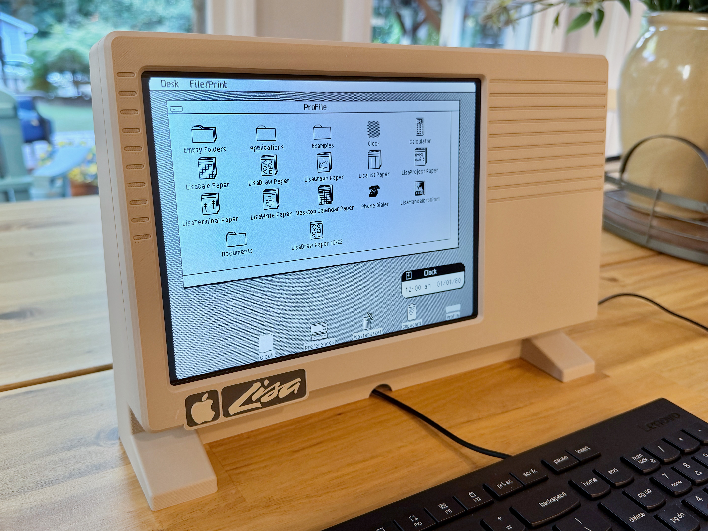
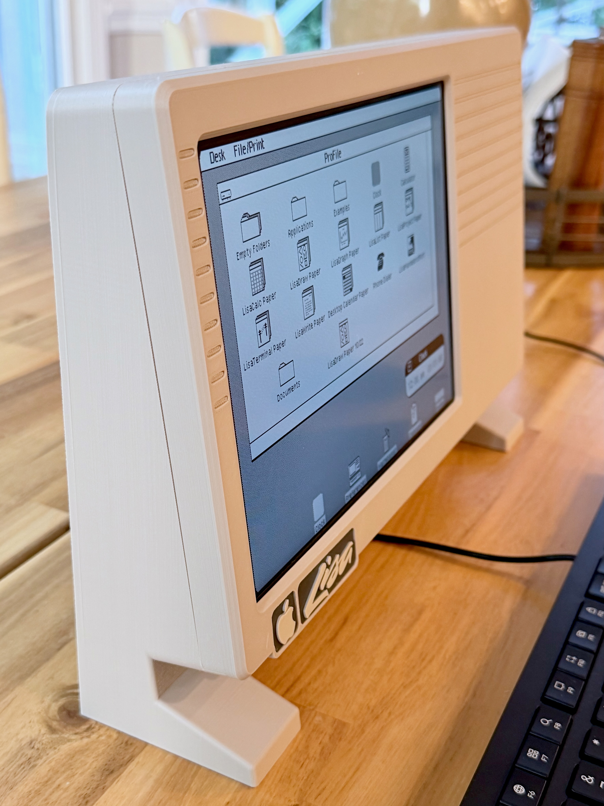
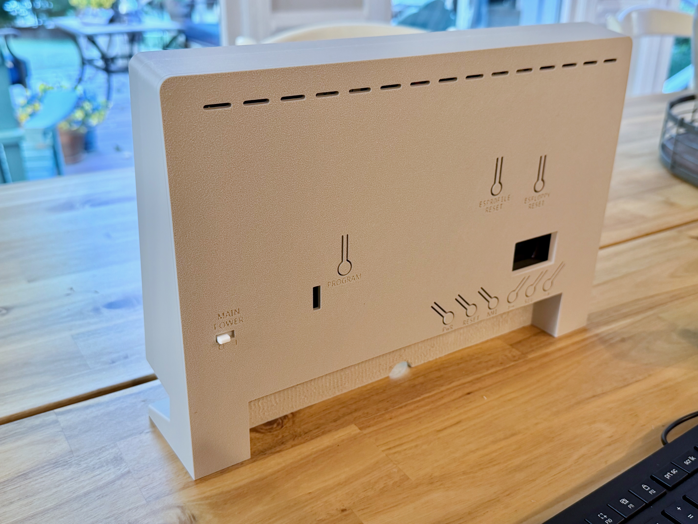
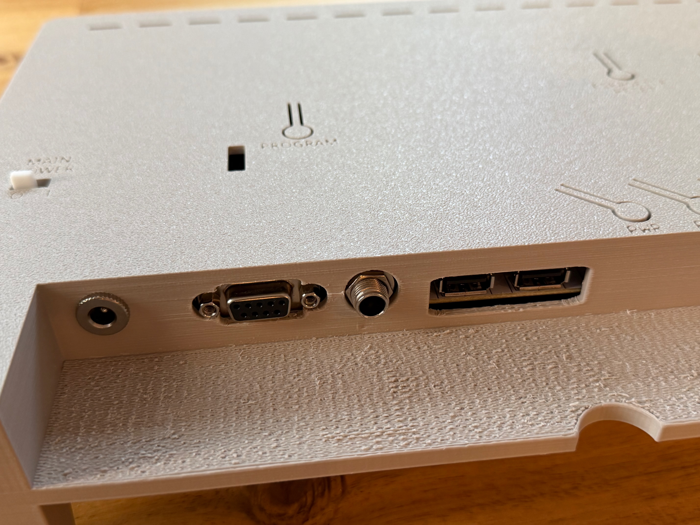
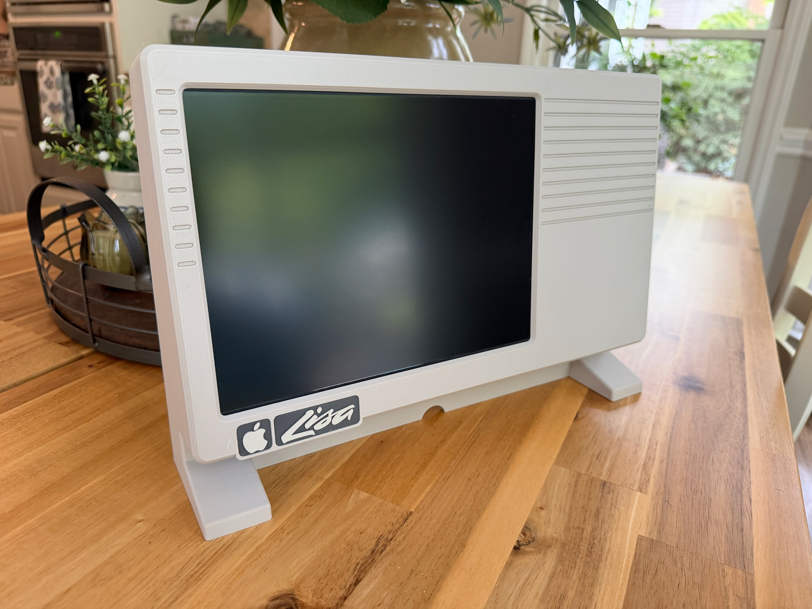

# Lisa Mini

A 3D-printable, Apple Lisa–inspired enclosure for building a mini all-in-one
around a [LisaFPGA](https://www.tindie.com/products/lisafpga/) board and an
11.6" 1080p widescreen LCD panel.



| | |
|---|---|
|  |  |
|  |  |

## About

This case is designed to house a LisaFPGA board — an FPGA-based
re-implementation of the original Apple Lisa — behind a compact modern LCD,
in an enclosure that echoes the look of the original 1983 Lisa: front vent
lines, a screen that leans back while the case stays vertical, and integrated
L-shaped feet with no visible seams between leg and case.

Designed for FDM printing, optimized to minimize supports where possible —
though both the front and back shells currently do need some supports
(see [Printing](#printing) below).

There's no built-in FloppyEmu, because the LisaFPGA has a floppy emulator
built in (ESFloppy) — no separate hardware needed. There are two designs
(see [Choose your design](#choose-your-design)). The stock one leaves the
LisaFPGA untouched and has cutouts for the ESFloppy control buttons and a
window to see the screen from the back, dressed up with a shroud
(`Lisa_Mini_ESFloppy_Shroud.obj`) since that opening sits well below the
back surface. The shroud's fit isn't perfect — it exposes a bit too much of
the area below the ESFloppy LCD, and needs some glue to stay in place. The
other design moves the ESFloppy screen and buttons, and the lit power
button, to the front, at the cost of soldering wires to the LisaFPGA.

## What's here

```
models/
  print-ready/
    common/      Parts printed for either design
    Lisa_Mini_With_ESFloppy_Screen_And_Buttons_On_Back/   Stock design: LisaFPGA left untouched
    Lisa_Mini_With_ESFloppy_Screen_And_Buttons_On_Front/  Front-mounted ESFloppy screen, buttons, and power button
  source/        Parametric OpenSCAD source + design notes
images/           Build photos and renders
docs/
  design_a/       ASSEMBLY.md and BOM.md for the ESFloppy-on-back design
  design_b/       ASSEMBLY.md and BOM.md for the ESFloppy-on-front design
  PRINTING.md     Slicer settings and printing notes
```

## Choose your design

There are two versions of the case. **Pick one** and print its folder plus
the `common/` parts.

| | ESFloppy on back (stock) | ESFloppy on front |
|---|---|---|
| Folder | `Lisa_Mini_With_ESFloppy_Screen_And_Buttons_On_Back/` | `Lisa_Mini_With_ESFloppy_Screen_And_Buttons_On_Front/` |
| LisaFPGA modifications | None -- the board is left untouched | Solder wires to the ESFloppy buttons, move the ESFloppy screen, and move the lit power button to the front (remove the board's own power LED, solder wires to the board) |
| ESFloppy screen and buttons | Rear window and button cutouts, dressed up with a shroud | Front-mounted, with printed button caps and a screen clip |
| Power button | Button cutout on rear case | Lit button on the front, plus a master rocker power switch |
| Difficulty | Easier | Needs soldering to the LisaFPGA, plus extra parts (see BOM) |

## Parts to print

**Common parts (either design)** -- `models/print-ready/common/`

| File | Part |
|---|---|
| `Lisa_Mini_LCD_Mount_Clips.obj` | LCD retaining clips |
| `Lisa_Mini_Lisa_Logo_Plate.obj` | Lisa logo badge insert (see note below) |
| `Lisa_Mini_Manufacturer_Blank_Logo_Plate.obj` | Blank badge insert for the bezel's second holder (see note below) |
| `Lisa_Mini_Power_Switch.obj` | Cap over the LisaFPGA's power switch (the one that turns the whole device on and off) |
| `Lisa_Mini_Back_LisaFPGA_SD_Slot_Covers.stl` | SD slot covers for the back |

**ESFloppy on back** -- `models/print-ready/Lisa_Mini_With_ESFloppy_Screen_And_Buttons_On_Back/`

| File | Part |
|---|---|
| `Lisa_Mini_Front.obj` | Front bezel / LCD mount |
| `Lisa_Mini_Back_LisaFPGA.obj` | Rear shell, sized for the LisaFPGA board |
| `Lisa_Mini_ESFloppy_Shroud.obj` | Dresses up the rear ESFloppy screen opening, which currently sits well below the back surface |

**ESFloppy on front** -- `models/print-ready/Lisa_Mini_With_ESFloppy_Screen_And_Buttons_On_Front/`

| File | Part |
|---|---|
| `Lisa_Mini_Front_With_ESFloppy_Screen.obj` | Front bezel with the ESFloppy screen opening |
| `Lisa_Mini_Front_With_ESFloppy_Slot_Filler_Black.obj` | Black slot filler for the front |
| `Lisa_Mini_Back_LisaFPGA_ESFloppy_Moved_To_Front.obj` | Rear shell with no ESFloppy window or buttons |
| `Lisa_Mini_ESFloppy_Screen_Clip.obj` | Holds the ESFloppy screen |
| `Lisa_Mini_ESFloppy_Button_Cap.obj` | ESFloppy button cap |
| `Lisa_Mini_ESFloppy_Button_Inner_qty3.obj` | Button inner part (single part; print 3 copies) |
| `Lisa_Mini_ESFloppy_Button_Outer_qty3.obj` | Button outer part (single part; print 3 copies) |
| `Lisa_Mini_Power-Button.stl` | Front-mounted lit power button |

Each design has its own parts list and build guide: Design A
([BOM](docs/design_a/BOM.md), [assembly](docs/design_a/ASSEMBLY.md)) and
Design B ([BOM](docs/design_b/BOM.md), [assembly](docs/design_b/ASSEMBLY.md)).

**Logo plate note:** the front bezel has holders for two badge plates. This
repo includes the Lisa logo plate (`Lisa_Mini_Lisa_Logo_Plate.obj`) for one
and a plain, unbranded insert
(`Lisa_Mini_Manufacturer_Blank_Logo_Plate.obj`) for the other — deliberately
not shipping an Apple logo plate here to avoid distributing Apple's
trademarked logo. If you want an Apple logo in that spot, you'll need to
source or model your own.

## Editing the design

The parametric source (`models/source/lisa_modern_template.scad`) is an
OpenSCAD model of the case shell and covers the overall body/vent/leg
geometry. `models/source/lisa_design.md` documents the design reference
image this was built against and the reasoning behind the current shape —
read it before changing proportions.

Note: the `print-ready/` OBJs are further along than the `.scad` source
file. The OpenSCAD model produced a simplified starter shell, which was
then brought into TinkerCAD for significant additional work — mounting
points, port/switch openings, LCD clip geometry, and the logo plate —
that isn't reflected in the `.scad` file. Treat the `.scad` file as the
best starting point for overall shell/vent/leg proportions, not as a 1:1
source for the exact release files; there's currently no single parametric
source that captures the final printed geometry end to end.

## Software

The case's screen opening is sized for the original 9.7" 4:3 Lisa-style
window, but the LCD actually used is an 11.6" 1080p widescreen panel — the
image doesn't natively fill (or center in) that opening. This build
requires [wottle/LisaFPGA](https://github.com/wottle/LisaFPGA), a fork of
the LisaFPGA software that adds the ability to offset the displayed image
so it lands correctly within the case's opening. Stock LisaFPGA firmware
will not position the image correctly for this case.

**Flash it before assembling the case** — see "Before you start" in the
assembly guide for your design
([A](docs/design_a/ASSEMBLY.md#before-you-start),
[B](docs/design_b/ASSEMBLY.md#before-you-start)) for why.

## Power design notes

The original plan was to power the LCD controller board directly off a 5V
USB-C input. That controller board didn't work reliably on 5V USB-C — the
board was later damaged during troubleshooting, so it's unconfirmed whether
5V USB-C itself was the actual problem or just correlated with what killed
it. The working setup, and what the BOM/case now assume, is a single 12V
barrel jack input split across two buck converters into separate 5V lines
for the LisaFPGA and the LCD controller. If you try 5V USB-C directly into
the controller board, treat it as unverified and have a fallback plan.

The `Lisa_Mini_Power_Switch.obj` cap only switches the LisaFPGA — there's
no separate power switch for the LCD. The plan is to just pull the 12V
input when not in use, which cuts power to both.

## Printing

See [`docs/PRINTING.md`](docs/PRINTING.md). Quick summary:

- Wall thickness: ~2.4mm
- Infill: 15–20%
- Bed size: 350mm — the model is 330mm wide (front face down, back face up)
- Both front and back shells currently need supports — back for the skirt
  between the legs, front for the logo plate badge holder area
- Front/back shells press-fit together (alignment bumps, no screws);
  everything else uses M3x4mm screws

## License

Design files are released under
[CC BY-NC-SA 4.0](https://creativecommons.org/licenses/by-nc-sa/4.0/) —
free to share and remix for non-commercial use, with attribution, under the
same license. See [`LICENSE`](LICENSE).

## Also published on

- [Thingiverse](https://www.thingiverse.com/thing:7406982)
- [Creality Cloud](https://www.crealitycloud.com/model-detail/6aa08dfae6a4b4ead4eae24b?profileId=6aa08dfae6a4b4ead4eae251)

Not published to MakerWorld/Bambu — no Bambu printer currently has a bed
large enough for the 330mm-wide front/back shells.
