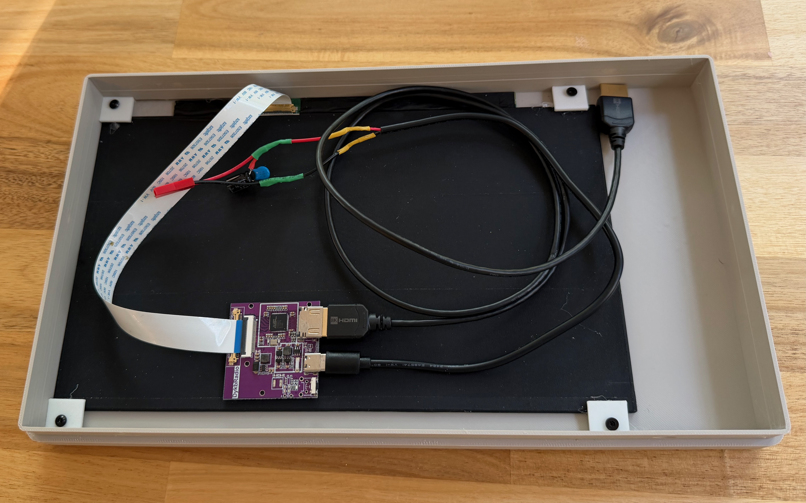
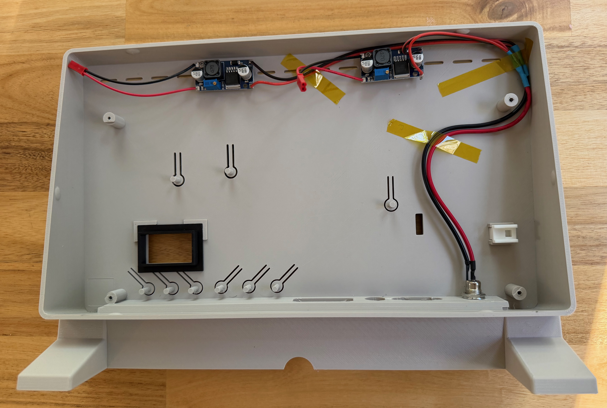
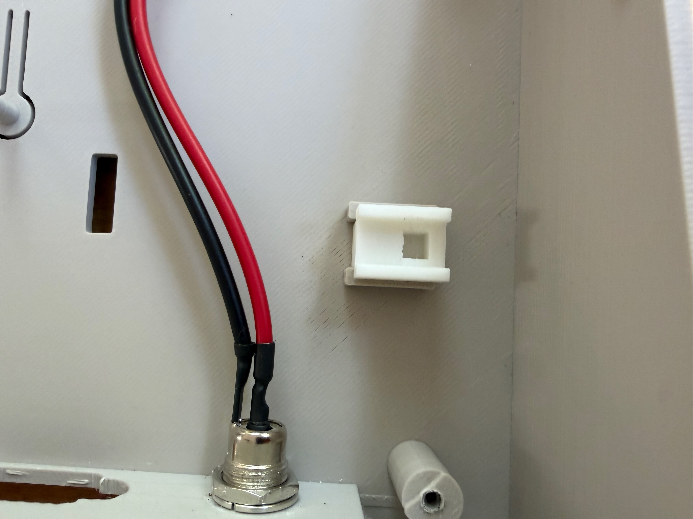
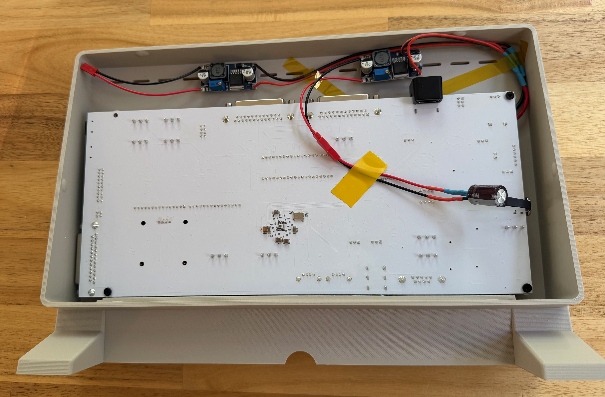
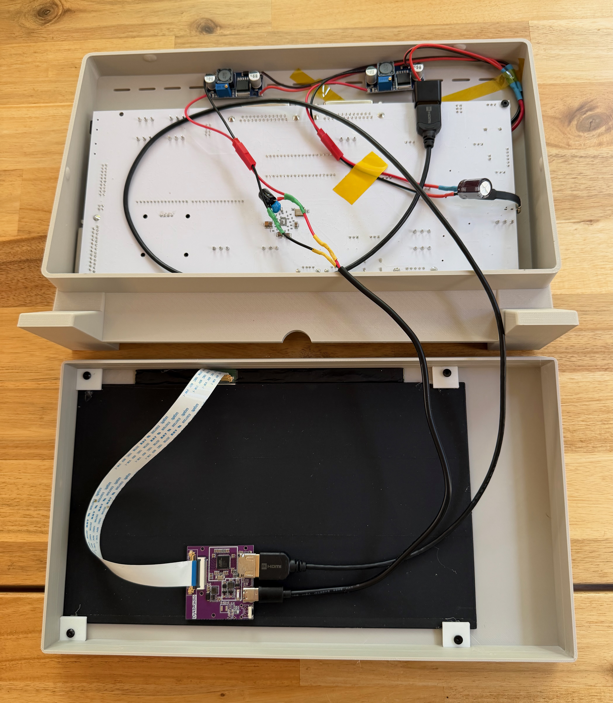

# Assembly Instructions

<!-- TODO: a few fit/tolerance details below are still unconfirmed --
     see the inline TODOs. -->

## Before you start

- Confirm you have all parts from [`BOM.md`](BOM.md)
- Test-fit the LCD panel and LisaFPGA board against the printed shells
  before final assembly
- Clean up any stringing/support marks around the vent lines and screen
  opening

## Steps

### Front assembly

1. **Prep the front shell**
   - Insert `Lisa_Mini_LCD_Mount_Clips.obj` into the front bezel's LCD
     mounting points
   - TODO: describe clip orientation / fit

2. **Mount the LCD**
   - Seat the LCD panel into the front bezel
   - Secure with the 4 LCD mount clips, each fastened with an M3x4mm screw
   - Stick the LCD controller board to the back of the LCD panel with
     double-sided tape, and connect the LCD's ribbon cable and small
     2-pin power connector to it

   

3. **Attach the logo plates**
   - Press-fit or glue `Lisa_Mini_Lisa_Logo_Plate.obj` into the bezel's Lisa
     logo plate holder
   - Press-fit or glue `Lisa_Mini_Manufacturer_Blank_Logo_Plate.obj` into
     the bezel's second holder — this repo ships it blank rather than an
     Apple logo (see the README for why); swap in your own part there if
     you want a logo
   - TODO: confirm fit tolerance (press-fit vs. adhesive)

### Back assembly

4. **Install the power input and buck converters**
   - Mount the 12V panel-mount barrel jack into the rear shell
   - Mount the two buck converters along the top edge of the rear shell
   - Wire the barrel jack's 12V output, splitting it into two leads — one
     to each buck converter's input

   

5. **Install the ESFloppy shroud**
   - Press-fit `Lisa_Mini_ESFloppy_Shroud.obj` into the rear ESFloppy
     screen opening — it dresses up that opening, which currently sits
     well below the back surface

6. **Install the power switch cap**
   - Before installing the LisaFPGA board, snap `Lisa_Mini_Power_Switch.obj`
     into its mounting point in the rear shell — the photo below shows its
     orientation. Do this now: once the LisaFPGA board is installed in the
     next step, it covers this area and the switch cap can no longer be
     placed.

   

7. **Install the LisaFPGA board**
   - Mount the LisaFPGA board into the rear shell
     (`Lisa_Mini_Back_LisaFPGA.obj`) and secure it to the standoffs with
     screws — this also covers up the barrel jack wiring underneath, and
     seats the board's onboard switch under the power switch cap from
     step 6
   - Connect the buck converters' 5V outputs to the LisaFPGA board's power
     input and, optionally, an inrush capacitor at the LisaFPGA's power
     connector

   

### Connect and close

8. **Wire it up**
   - Connect the second buck converter's 5V output to the LCD controller
     board via a USB-C connector rather than a permanent connection
   - Connect HDMI between the LisaFPGA and the LCD controller board

   These connections use USB-C connectors rather than soldered/permanent
   wiring, deliberately — it lets the front-mounted parts (LCD + controller
   board) and back-mounted parts (LisaFPGA + power) quick-disconnect from
   each other, making it much easier to separate the shells for
   maintenance.

   

9. **Join front and back shells**
   - The BOM's 4 M3x4mm screws are all accounted for by the LCD mount
     clips in step 2, so this joint is snap-fit
   - TODO: confirm snap-fit engagement points / any assembly order that
     matters

10. **Final check**
   - Power on and verify display output before fully closing up the case
