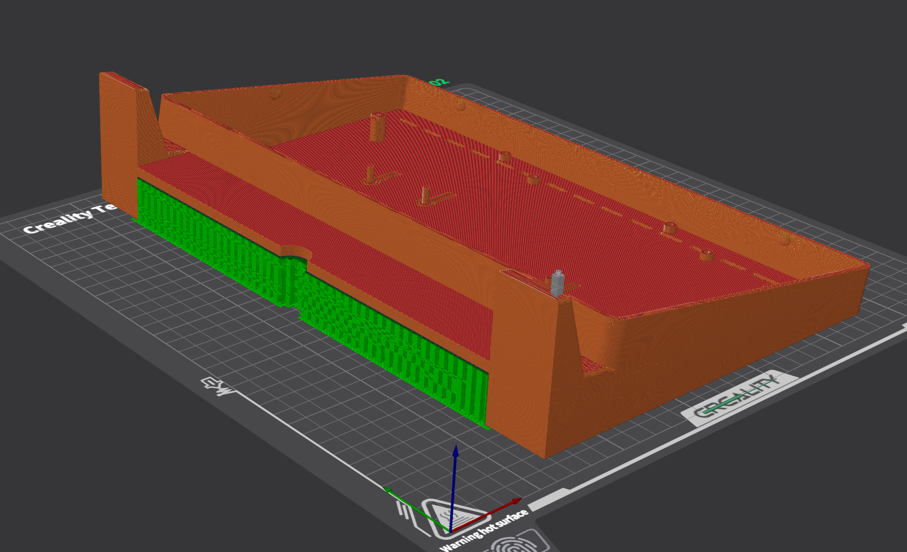
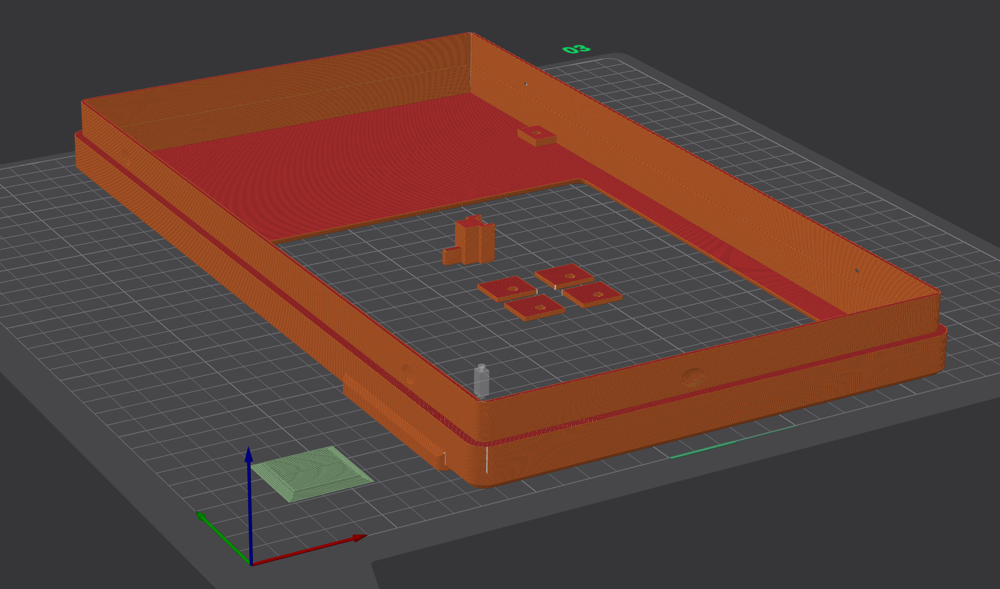

# Printing Notes

## Recommended settings

| Setting | Value |
|---|---|
| Wall thickness | ~2.4mm (2 perimeters at 0.4mm nozzle, or adjust to match) |
| Infill | 15–20% |
| Layer height | 0.2mm for all parts, except `Lisa_Mini_Lisa_Logo_Plate.obj` — 0.12mm with ironing enabled, for surface quality (TODO: confirm whether `Lisa_Mini_Manufacturer_Blank_Logo_Plate.obj` gets the same treatment) |
| Supports | Front and back both need supports (see below) |
| Bed size required | 350mm — the model is 330mm wide |

## Orientation

- `Lisa_Mini_Front_11.6_LCD_Mount_With_Logo_Plate_Holders.obj` — print face
  down
- `Lisa_Mini_Back_LisaFPGA.obj` — print face up
- `Lisa_Mini_LCD_Mount_Clips.obj` — TODO
- `Lisa_Mini_Lisa_Logo_Plate.obj` — TODO
- `Lisa_Mini_Manufacturer_Blank_Logo_Plate.obj` — TODO
- `Lisa_Mini_Power_Switch.obj` — TODO
- `Lisa_Mini_ESFloppy_Shroud.obj` — no supports needed; recommended in
  black filament since it's visible on the back of the case

Slicer plating for both shells:

The front shell plates together with the LCD mount clips and power switch,
using the open bed space inside the screen cutout.

## Bed size / smaller printers

The model is 330mm wide, so front/back shells need a 350mm print bed to
print in one piece as designed. If your printer's bed is smaller, you can
slice the front/back shells in half and print in two pieces — but the seam
where the halves join will be visible on the finished part. There's
currently no version of this design pre-split for smaller beds.

## Supports

The design was optimized to minimize supports overall, but both shells
currently need them:

- **Back** (`Lisa_Mini_Back_LisaFPGA.obj`) — the skirt between the legs is
  the cause. It's possible to remove that skirt to eliminate most/all of
  the back's support requirement, but that variant hasn't been made yet.
- **Front** (`Lisa_Mini_Front_11.6_LCD_Mount_With_Logo_Plate_Holders.obj`) —
  needed under the logo plate badge holder area. A PETG support interface
  layer was used there to improve surface quality, though it matters less
  than usual since a logo plate gets inserted into that area anyway,
  covering it.

Print the LCD mount clips (`Lisa_Mini_LCD_Mount_Clips.obj`) and the power
switch (`Lisa_Mini_Power_Switch.obj`) on the same plate as the front
shell — the screen cutout leaves plenty of bed space for these small
parts.

## Material

<!-- TODO: note tested filament (PLA/PETG/ABS) and any warping considerations
     for the larger front/back shells -->

## Known print issues

<!-- TODO: note any issues found while dialing in prints (warping,
     stringing on vents, tolerance on LCD clips, etc.) -->
